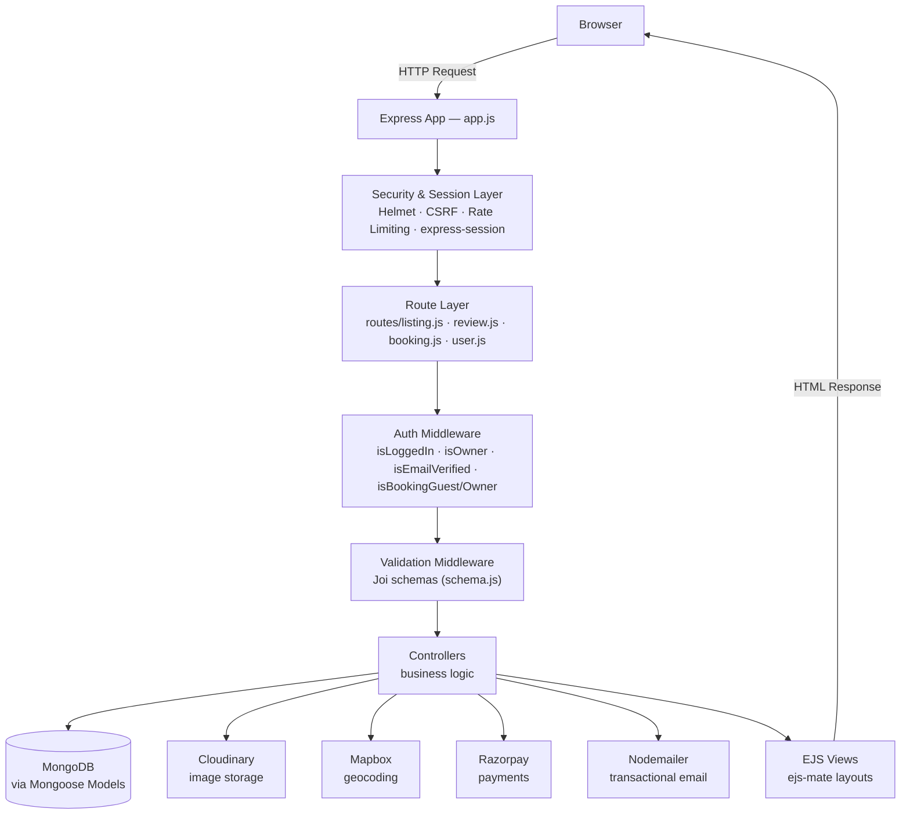
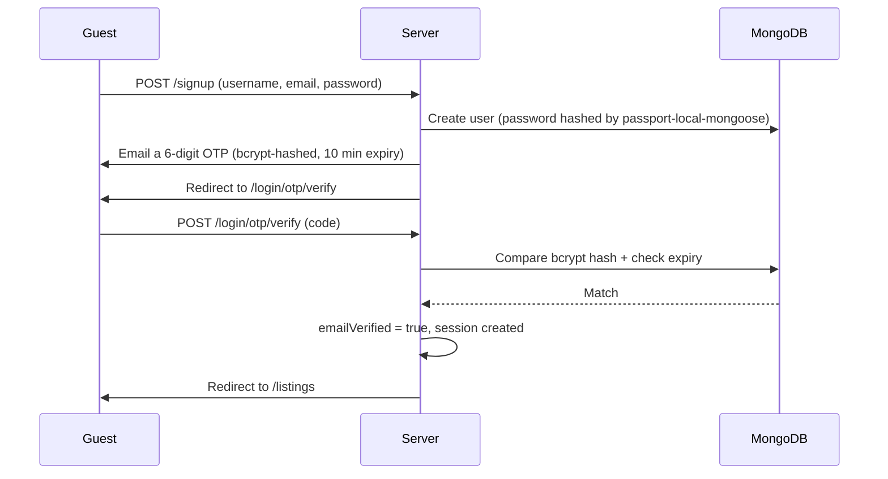
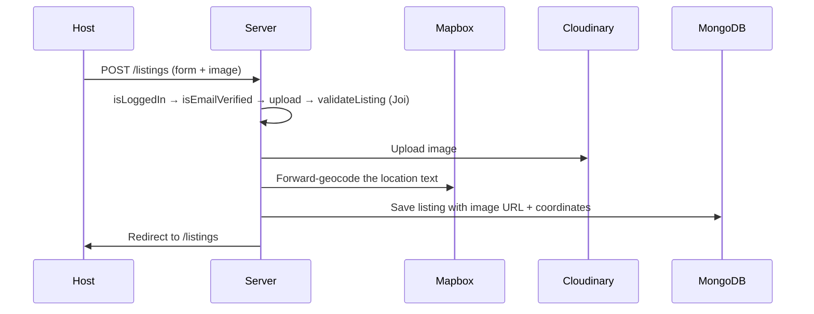
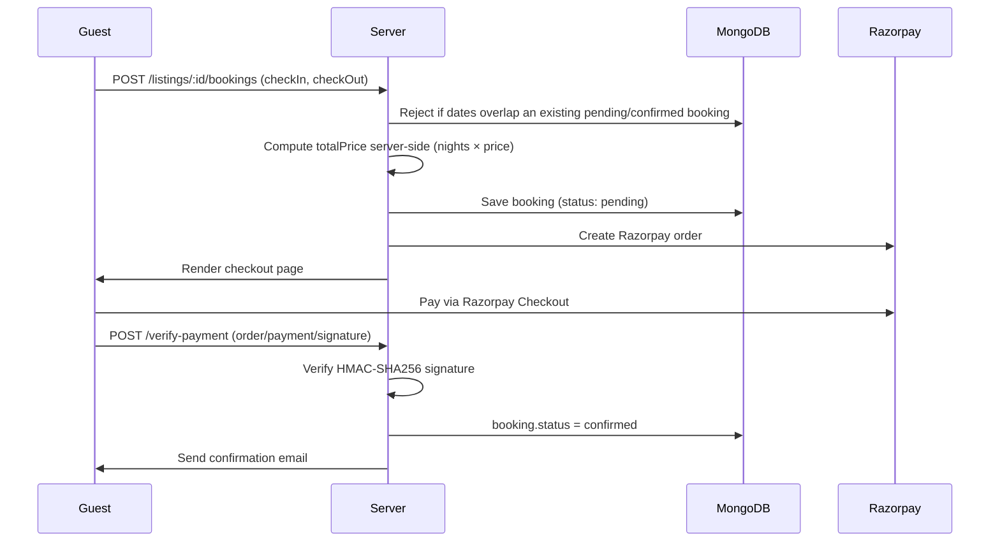

<div align="center">

# 🏡 Wanderlust

### Discover a stay. Book it with confidence. Travel without the guesswork.

A full-stack vacation rental platform — built end-to-end with session-based auth (local + Google OAuth), OTP email verification, Mapbox geocoding, Cloudinary image storage, Razorpay payments, and a Jest test suite backed by an in-memory MongoDB.

[](https://nodejs.org/)
[](https://expressjs.com/)
[](https://www.mongodb.com/)
[](https://ejs.co/)
[](https://www.passportjs.org/)
[](https://razorpay.com/)
[](https://jestjs.io/)

[](https://github.com/Swarajbabu/Wanderlust-Travel-Stay-Booking-Application/stargazers)
[](https://github.com/Swarajbabu/Wanderlust-Travel-Stay-Booking-Application/commits/main)
[](https://github.com/Swarajbabu/Wanderlust-Travel-Stay-Booking-Application/issues)

[**Live Demo**](YOUR_DEPLOYMENT_URL) · [**Report Bug**](https://github.com/Swarajbabu/Wanderlust-Travel-Stay-Booking-Application/issues) · [**Request Feature**](https://github.com/Swarajbabu/Wanderlust-Travel-Stay-Booking-Application/issues)

</div>

---

## 📸 Project Preview

> Screenshots aren't bundled with this README yet. Drop images into `assets/screenshots/` using the filenames below, and they'll render automatically once pushed.

| Page | Path |
|---|---|
| Homepage / Listings feed | `assets/screenshots/home.png` |
| Listing details page | `assets/screenshots/listing-details.png` |
| Create listing form | `assets/screenshots/create-listing.png` |
| Login / Signup | `assets/screenshots/auth.png` |
| Booking checkout (Razorpay) | `assets/screenshots/checkout.png` |
| My Bookings dashboard | `assets/screenshots/my-bookings.png` |

```markdown
<!-- Example embed once the file exists -->

```

---

## 📑 Table of Contents

- [About The Project](#-about-the-project)
- [Key Features](#-key-features)
- [Tech Stack](#-tech-stack)
- [Architecture](#-architecture)
- [Application Flow](#-application-flow)
- [Authentication & Authorization](#-authentication--authorization)
- [Database Design](#-database-design)
- [API / Routes](#-api--routes)
- [Project Structure](#-project-structure)
- [Installation](#-installation)
- [Environment Variables](#-environment-variables)
- [Running Locally](#-running-locally)
- [Seed Data](#-seed-data)
- [Testing](#-testing)
- [Deployment](#-deployment)
- [Security](#-security)
- [Performance & Scalability](#-performance--scalability)
- [Future Improvements](#-future-improvements)
- [Learning Outcomes](#-learning-outcomes)
- [Contributing](#-contributing)
- [License](#-license)
- [Author](#-author)

---

## 🧭 About The Project

**Wanderlust** is a full-stack vacation-rental booking platform in the spirit of Airbnb: hosts list properties, guests search and book them, and both sides manage the stay through to payment and review — all server-rendered with Node.js, Express, MongoDB, and EJS.

Booking platforms are a deceptively good engineering exercise. They aren't just CRUD — they force you to solve for **double-booking prevention**, **server-trusted pricing**, **payment integrity**, and **role-based access** where the same resource (a listing, a booking) behaves differently depending on who's looking at it. Wanderlust was built to solve each of those problems for real, not to fake them for a portfolio.

What a visitor can actually do:

- Browse, search, and filter property listings by category, keyword, or location
- Register with email/password, Google, or a one-time email code — with mandatory email verification before listing anything
- Publish listings with photo uploads (Cloudinary) and automatic map geocoding (Mapbox)
- Book a stay with real-time availability checking, pay through Razorpay, and receive an email confirmation
- Leave a rating and review — but only after a **confirmed, completed** stay, not just an account
- Manage bookings as a guest (cancel) or as a host (confirm/cancel bookings on their own listings)

This project exists to demonstrate practical full-stack ability: designing a relational-ish document schema, writing server-side business rules that don't trust the client, integrating three real third-party APIs (payments, maps, image storage) end-to-end, and backing the whole thing with an automated test suite.

---

## ✨ Key Features

### 🔐 Authentication
- Local signup/login via Passport (`passport-local-mongoose` — salted & hashed passwords, no plaintext storage)
- Google OAuth 2.0 login, with automatic account linking when the Google email matches an existing local account
- Mandatory email verification via a 6-digit, bcrypt-hashed OTP (10-minute expiry) before a user can create listings
- Passwordless OTP login as an alternative to a password
- Forgot / reset password flow using a random, time-limited token (1-hour expiry) delivered by email
- Rate limiting on login, signup, and OTP endpoints to blunt brute-force and spam attempts
- Sessions persisted in MongoDB (`connect-mongo`), not in server memory

### 🏘️ Listings
- Full CRUD, restricted to the listing's owner for edit/delete
- Cloudinary-hosted image upload (5MB limit, jpg/jpeg/png) with automatic cleanup of the old image on replace/delete
- Automatic geocoding of the typed location into map coordinates via Mapbox, with on-demand backfill for older records missing geometry
- 17 built-in categories (Rooms, Iconic Cities, Mountains, Castles, Camping, etc.) for filtering
- Full-text search across title/location/country with an automatic regex fallback and server-side pagination (12 per page)
- Interactive Mapbox map on the listing page — the marker shows the area, with the note that the exact address is shared only after booking

### 📅 Bookings & Payments
- Flatpickr date picker that fetches already-booked ranges and disables them live, before submission
- Server-side overlap check rejects a booking if it collides with any pending/confirmed booking for that listing
- Total price is **always computed server-side** (nights × nightly rate) — the client can't submit its own price
- Razorpay order creation → hosted checkout → payment signature verified server-side with HMAC-SHA256 before a booking is marked confirmed
- Booking lifecycle: `pending → confirmed → cancelled`, with guests blocked from cancelling on/after check-in, and hosts able to confirm or cancel bookings on their own listings
- Automatic booking-confirmation email on successful payment

### ⭐ Reviews
- 1–5 star rating plus a comment
- Gated behind a real stay: only guests with a **confirmed** booking whose check-out date has already passed can review a listing
- Only the original author can delete their review
- Deleting a listing cascades to delete its associated reviews

### 🎨 UI
- Server-rendered EJS with `ejs-mate` layouts, a shared navbar/footer, and flash messaging for success/error feedback
- Responsive, mobile-friendly Bootstrap-based layout
- Custom CSS per page (auth, listing forms, ratings, listing detail)

### 🛡️ Security
- Helmet with a hand-written Content-Security-Policy (only Mapbox, Cloudinary, Razorpay, and known CDNs are allow-listed)
- CSRF protection (double-submit cookie pattern via `csrf-csrf`) on every state-changing request
- Server-side Joi validation on every listing, review, and booking submission
- Ownership and authorization checked server-side on every protected route — never inferred from the client

---

## 🧰 Tech Stack

| Category | Technology | Why it's used |
|---|---|---|
| **Runtime** | Node.js | JavaScript runtime for the server |
| **Framework** | Express.js | Routing, middleware pipeline, request/response handling |
| **Database** | MongoDB | Document store — flexible schema for listings/bookings/reviews |
| **ODM** | Mongoose | Schema validation, model relationships, hooks (e.g. cascading review deletes) |
| **Views** | EJS + `ejs-mate` | Server-rendered HTML with shared layouts/partials |
| **Auth** | Passport.js (`passport-local`, `passport-google-oauth20`, `passport-local-mongoose`) | Pluggable local + OAuth strategies; handles password hashing |
| **Sessions** | `express-session` + `connect-mongo` | Persistent, MongoDB-backed sessions (survive server restarts) |
| **Validation** | Joi | Server-side schema validation for listings, reviews, bookings |
| **Image storage** | Cloudinary + `multer` + `multer-storage-cloudinary` | Direct-to-cloud image upload and CDN delivery |
| **Maps/Geocoding** | Mapbox (`@mapbox/mapbox-sdk`) | Converts a typed location into coordinates; renders the listing map |
| **Payments** | Razorpay | Order creation, hosted checkout, signature-verified payment confirmation |
| **Email** | Nodemailer | OTP, password-reset, and booking-confirmation emails (falls back to a logged stub if SMTP isn't configured) |
| **Security** | Helmet, `csrf-csrf`, `express-rate-limit` | CSP headers, CSRF protection, brute-force throttling |
| **Logging** | Winston + Morgan | Structured application logs and HTTP request logs |
| **Testing** | Jest, Supertest, `mongodb-memory-server` | Integration tests against a real (in-memory) MongoDB, no external DB needed |
| **Tooling** | Git, GitHub, npm | Version control and package management |

---

## 🏗️ Architecture

Wanderlust follows a layered MVC-style structure: routes stay thin, middleware enforces cross-cutting concerns (auth, validation, security), and controllers own the business logic.



**Layer responsibilities**

| Layer | Responsibility |
|---|---|
| `routes/` | Declares URLs, wires up middleware chains, delegates to controllers |
| `middleware.js` | Auth checks, ownership checks, Joi validation gates |
| `controllers/` | Business logic — the only layer that talks to models and external APIs |
| `modals/` *(model schemas)* | Mongoose schemas: `User`, `Listing`, `Review`, `Booking` |
| `views/` | EJS templates rendered by controllers |
| `config/` | DB connection, session store, Passport strategies, email transport, logger, env validation |

> **Note:** the schema/model directory is named `modals/` in the repository (rather than the conventional `models/`). It's a naming quirk, not a functional issue — see the [repository improvement checklist](#repository-improvement-checklist) at the end of this document.

---

## 🔄 Application Flow

### Signup → Email Verification → Login



### Listing Creation



### Booking & Payment



### Review

```
Guest → GET /listings/:id → POST /listings/:id/reviews
      → isLoggedIn → Joi validateReview
      → Server checks: does this guest have a CONFIRMED booking
        on this listing with checkOut already in the past?
      → No  → flash error, redirect to listing
      → Yes → review saved, pushed onto listing.reviews
```

---

## 🔑 Authentication & Authorization

These are two different questions, and Wanderlust answers them with two different mechanisms:

- **Authentication** — *"Who are you?"* Handled by Passport: a local username/password strategy, a Google OAuth2 strategy, and an OTP-based passwordless path. All three end the same way — a server-side session is created and stored in MongoDB.
- **Authorization** — *"What are you allowed to do?"* Handled by dedicated middleware in `middleware.js`, applied per-route:

| Middleware | Enforces |
|---|---|
| `isLoggedIn` | A session must exist to reach the route |
| `isEmailVerified` | The user's email must be verified before creating/editing a listing |
| `isOwner` | Only the listing's `owner` can edit or delete it |
| `isReviewAuthor` | Only a review's `author` can delete it |
| `isBookingGuest` | Only the booking's `guest` can pay for or view checkout on it |
| `isBookingOwner` | Only the listing's owner can confirm a booking on it |
| `isBookingGuestOrOwner` | Either party can cancel a booking |
| `validateListing` / `validateReview` / `validateBooking` | Joi schema validation before the controller runs |

**Why this matters in practice:** if User A creates Listing X, User B can view it but the `PUT`/`DELETE` routes for `/listings/X` are guarded by `isOwner`, which re-fetches the listing from MongoDB and compares `listing.owner` against `res.locals.currUser._id` on the server. The UI simply doesn't render an edit button for User B — but even if User B crafted the request by hand, the server would reject it. The same pattern applies to bookings and reviews: ownership is a database fact, checked on the server, never a trust assumption based on what the client claims.

---

## 🗄️ Database Design

Four collections, related by ObjectId reference (Mongoose `populate`):

```
User
 ├── owns          → Listing.owner
 ├── writes        → Review.author
 └── books         → Booking.guest

Listing
 ├── belongs to    → User (owner)
 ├── has many      → Review (embedded ref array)
 └── has many      → Booking

Review
 ├── belongs to    → User (author)
 └── belongs to    → Listing (via Listing.reviews[])

Booking
 ├── belongs to    → Listing
 └── belongs to    → User (guest)
```

**Actual schema fields** (from `modals/*.js`):

<details>
<summary><strong>User</strong></summary>

| Field | Type | Notes |
|---|---|---|
| `username`, `hash`, `salt` | — | Added automatically by `passport-local-mongoose` |
| `email` | String | Required, unique |
| `googleId` | String | Unique, sparse (only set for Google-auth users) |
| `authProvider` | String | `"local"` \| `"google"` |
| `otpHash`, `otpExpiresAt` | String, Date | Bcrypt-hashed OTP + expiry |
| `emailVerified` | Boolean | Default `false` |
| `resetPasswordToken`, `resetPasswordExpires` | String, Date | Forgot-password flow |

</details>

<details>
<summary><strong>Listing</strong></summary>

| Field | Type | Notes |
|---|---|---|
| `title` | String | Required |
| `description`, `location`, `country` | String | — |
| `image` | `{ url, filename }` | Cloudinary reference |
| `price` | Number | — |
| `category` | String | Enum of 17 predefined categories |
| `geometry` | GeoJSON `Point` | `{ type, coordinates: [lng, lat] }` |
| `owner` | ObjectId → `User` | — |
| `reviews` | `[ObjectId → Review]` | — |

Indexed with a MongoDB text index on `title`, `location`, and `country` for search. A `post("findOneAndDelete")` hook deletes all associated reviews when a listing is removed.

</details>

<details>
<summary><strong>Review</strong></summary>

| Field | Type | Notes |
|---|---|---|
| `comment` | String | — |
| `rating` | Number | 1–5 |
| `createdAt` | Date | Default `Date.now()` |
| `author` | ObjectId → `User` | — |

</details>

<details>
<summary><strong>Booking</strong></summary>

| Field | Type | Notes |
|---|---|---|
| `listing` | ObjectId → `Listing` | Required |
| `guest` | ObjectId → `User` | Required |
| `checkIn`, `checkOut` | Date | Required; a `pre("save")` hook rejects `checkOut <= checkIn` |
| `totalPrice` | Number | Computed server-side |
| `status` | String | `"pending"` \| `"confirmed"` \| `"cancelled"` |
| `paymentId` | String | Set once Razorpay payment is verified |
| `createdAt` | Date | Default `Date.now` |

</details>

---

## 🔌 API / Routes

All routes below are taken directly from `routes/*.js`.

**Listings** — mounted at `/listings`

| Method | Route | Purpose | Guarded by |
|---|---|---|---|
| GET | `/` | List, search (`?q=`), filter (`?category=`), paginate | Public |
| POST | `/` | Create a listing | `isLoggedIn`, `isEmailVerified`, `validateListing` |
| GET | `/new` | Render the new-listing form | `isLoggedIn`, `isEmailVerified` |
| GET | `/:id` | View a listing | Public |
| PUT | `/:id` | Update a listing | `isLoggedIn`, `isOwner`, `validateListing` |
| DELETE | `/:id` | Delete a listing | `isLoggedIn`, `isOwner` |
| GET | `/:id/edit` | Render the edit form | `isLoggedIn`, `isOwner` |

**Reviews** — mounted at `/listings/:id/reviews`

| Method | Route | Purpose | Guarded by |
|---|---|---|---|
| POST | `/` | Create a review | `isLoggedIn`, `validateReview`, completed-stay check |
| DELETE | `/:reviewId` | Delete a review | `isLoggedIn`, `isReviewAuthor` |

**Bookings** — mounted at `/`

| Method | Route | Purpose | Guarded by |
|---|---|---|---|
| POST | `/listings/:id/bookings` | Create a booking | `isLoggedIn`, `validateBooking` |
| GET | `/listings/:id/bookings/booked-dates` | Fetch booked date ranges (JSON, for the date picker) | Public |
| GET | `/bookings` | View my bookings | `isLoggedIn` |
| PATCH | `/bookings/:bookingId/cancel` | Cancel a booking | `isLoggedIn`, `isBookingGuestOrOwner` |
| PATCH | `/bookings/:bookingId/confirm` | Confirm a booking | `isLoggedIn`, `isBookingOwner` |
| GET | `/bookings/:bookingId/checkout` | Render Razorpay checkout | `isLoggedIn`, `isBookingGuest` |
| POST | `/bookings/:bookingId/verify-payment` | Verify Razorpay signature, confirm booking | `isLoggedIn`, `isBookingGuest` |

**Users** — mounted at `/`

| Method | Route | Purpose | Guarded by |
|---|---|---|---|
| GET / POST | `/signup` | Render / submit registration | Public |
| GET / POST | `/login` | Render / submit local login | Public, rate-limited |
| GET | `/logout` | End the session | — |
| GET / POST | `/forgot-password` | Render / submit reset request | Public |
| GET / POST | `/reset-password/:token` | Render / submit new password | Public |
| GET | `/auth/google` | Start Google OAuth | Public |
| GET | `/auth/google/callback` | Google OAuth callback | Public |
| GET / POST | `/login/otp/request` | Render / request an OTP | Public, rate-limited |
| GET / POST | `/login/otp/verify` | Render / verify an OTP | Public, rate-limited |

---

## 📁 Project Structure

```text
Wanderlust-Travel-Stay-Booking-Application/
│
├── config/
│   ├── db.js              # MongoDB connection
│   ├── email.js           # Nodemailer transport (falls back to a logged stub)
│   ├── logger.js          # Winston logger configuration
│   ├── passport.js        # Local + Google OAuth2 strategy setup
│   ├── session.js         # express-session + connect-mongo store
│   └── validateEnv.js     # Fails fast at boot if required env vars are missing
│
├── controllers/
│   ├── booking.js         # Booking lifecycle + Razorpay integration
│   ├── listing.js         # Listing CRUD, search, geocoding
│   ├── otp.js              # OTP request/verify logic
│   ├── review.js          # Review create/delete
│   └── user.js             # Signup, login, logout, password reset, Google callback
│
├── init/
│   ├── data.js             # Seed listing data
│   └── index.js            # Seed script entry point
│
├── modals/                 # Mongoose schemas (see naming note above)
│   ├── booking.js
│   ├── listing.js
│   ├── review.js
│   └── user.js
│
├── public/
│   ├── css/                 # Per-page stylesheets
│   └── js/
│       ├── map.js           # Mapbox GL rendering on the listing page
│       └── script.js
│
├── routes/
│   ├── booking.js
│   ├── listing.js
│   ├── review.js
│   └── user.js
│
├── tests/
│   ├── auth.test.js         # Signup, login, OTP, Google OAuth, password reset
│   ├── bookings.test.js     # Overlap detection, pricing, Razorpay verification
│   └── listings.test.js     # CRUD + ownership authorization
│
├── utility/
│   ├── ExpressError.js      # Custom error class
│   └── wrapAsync.js          # Async route error wrapper
│
├── views/
│   ├── bookings/             # Checkout + my-bookings pages
│   ├── includes/              # navbar, footer, flash partials
│   ├── layouts/                # ejs-mate boilerplate layout
│   ├── listings/                # index, show, new, edit
│   ├── users/                    # signup, login, forgot/reset, OTP forms
│   └── error.ejs
│
├── app.js                    # Express app, middleware pipeline, route mounting
├── cloudconfig.js            # Cloudinary + multer-storage-cloudinary setup
├── middleware.js              # Auth/authorization/validation middleware
├── schema.js                   # Joi validation schemas
├── .env.example                 # Template for required environment variables
├── .gitignore
├── package.json
└── Readme.md
```

---

## ⚙️ Installation

### 1. Clone the repository

```bash
git clone https://github.com/Swarajbabu/Wanderlust-Travel-Stay-Booking-Application.git
cd Wanderlust-Travel-Stay-Booking-Application
```

### 2. Install dependencies

```bash
npm install
```

### 3. Configure environment variables

```bash
cp .env.example .env
```

Then fill in the values described below. **Never commit `.env`** — it's already excluded via `.gitignore`.

---

## 🔐 Environment Variables

Taken directly from `.env.example` and `config/validateEnv.js`. The app **will not start** outside of test mode if any required variable is missing.

| Variable | Required | Purpose |
|---|---|---|
| `SECRET` | ✅ | Session/cookie signing secret |
| `MONGODB_ATLAS` | ✅ | MongoDB connection string |
| `CLOUDINARY_CLOUD_NAME` | ✅ | Cloudinary account |
| `CLOUDINARY_API_KEY` | ✅ | Cloudinary account |
| `CLOUDINARY_API_SECRET` | ✅ | Cloudinary account |
| `MAP_TOKEN` | ✅ | Mapbox access token (geocoding + map rendering) |
| `RAZORPAY_KEY_ID` | ✅ | Razorpay account |
| `RAZORPAY_KEY_SECRET` | ✅ | Razorpay account |
| `GOOGLE_CLIENT_ID` | ✅ | Google OAuth2 |
| `GOOGLE_CLIENT_SECRET` | ✅ | Google OAuth2 |
| `GOOGLE_CALLBACK_URL` | ✅ | Google OAuth2 redirect URL |
| `PORT` | Optional | Defaults to `8080` |
| `SMTP_HOST`, `SMTP_PORT`, `SMTP_USER`, `SMTP_PASS`, `SMTP_FROM` | Optional | If unset, outgoing emails are logged via Winston instead of sent (`config/email.js`) |

> ⚠️ **Verify:** `.env.example` sets `PORT=8080`, but the sample `GOOGLE_CALLBACK_URL` points at `http://localhost:8081/...`. `app.js` defaults to port `8080` if `PORT` is unset. Double-check your `.env` uses matching ports before testing Google OAuth locally.

---

## ▶️ Running Locally

```bash
npm start
```

This runs `node app.js` (see `package.json`). By default the app listens on `http://localhost:8080` (or whatever `PORT` you set), and `/` redirects to `/listings`.

> `nodemon` is listed as a dev dependency but there's currently no `dev` script wired up in `package.json`. Until one is added, you can run `npx nodemon app.js` directly for auto-restart during development.

---

## 🌱 Seed Data

`init/index.js` connects to `MONGODB_ATLAS`, wipes the `Listing` collection, and inserts the sample listings from `init/data.js`.

```bash
node init/index.js
```

Use this on a fresh database to populate listings for local testing.

---

## 🧪 Testing

```bash
npm test
```

Runs `jest --runInBand --detectOpenHandles --forceExit`. Tests spin up `mongodb-memory-server`, so **no real database connection is needed** to run the suite.

| File | Covers |
|---|---|
| `tests/auth.test.js` | Signup + auto-login, wrong-password rejection, protected-route redirects, forgot/reset password, Google OAuth signup + account linking, email-verification gating, OTP request/verify |
| `tests/bookings.test.js` | Non-overlapping bookings + server-side price calculation, overlap rejection, Razorpay signature verification confirming a booking |
| `tests/listings.test.js` | Owner CRUD flow, non-owner update/delete rejection |

13 test cases total across the three files.

---

## 🚀 Deployment

The app isn't currently deployed at a public URL in this repository — the badge above is a placeholder until one exists. To deploy it on any Node-friendly host (Render, Railway, Fly.io, an EC2/VM, etc.):

1. Provision a MongoDB Atlas cluster and set `MONGODB_ATLAS`.
2. Set every variable listed in [Environment Variables](#-environment-variables) in your host's environment/secrets manager — never in source control.
3. Set `NODE_ENV=production` (this switches Morgan/Winston to combined/JSON logging).
4. Ensure the host allows outbound HTTPS to Cloudinary, Mapbox, and Razorpay — `app.js`'s Helmet CSP already allow-lists these domains.
5. Set `app.set("trust proxy", 1)` is already configured for use behind a reverse proxy/load balancer.
6. Once deployed over HTTPS, flip the CSRF cookie's `secure` flag to `true` in `app.js` (currently `false` for local HTTP development — see the code comment).
7. Static assets are served from `public/` by Express; Cloudinary handles listing images independently.

`[Live Demo](YOUR_DEPLOYMENT_URL)` — replace once deployed.

---

## 🔒 Security

**Implemented**

- Passwords never stored in plaintext — hashed/salted by `passport-local-mongoose`
- OTPs and password-reset tokens are single-use, time-limited, and hashed/random respectively
- CSRF protection (double-submit cookie) on all state-changing requests
- Helmet with a custom Content-Security-Policy scoped to known third-party origins
- `express-rate-limit` on login, signup, and OTP endpoints
- Server-side Joi validation on every mutating route
- Server-side ownership checks on every protected resource — never trusts client-submitted IDs
- Booking price always computed server-side, never accepted from the client
- Razorpay payment signatures verified server-side via HMAC-SHA256 before confirming a booking
- Search input is regex-escaped before being used in a MongoDB query
- Startup fails fast if required secrets are missing (`config/validateEnv.js`)
- Secrets excluded from git via `.gitignore`, with a `.env.example` template for onboarding

**Recommended Improvements**

- Flip the CSRF/session cookie `secure` flag to `true` once served over HTTPS
- Add CAPTCHA/challenge on signup and OTP-request routes to complement rate limiting
- Add automated dependency scanning (Dependabot, `npm audit` in CI, or CodeQL)
- Add a `SECURITY.md` with a disclosure process
- Load/penetration-test the payment and auth flows before a production launch

---

## ⚡ Performance & Scalability

**Currently implemented**

- Gzip compression (`compression` middleware)
- MongoDB text index on `title`/`location`/`country` for fast search
- Offset-based pagination (12 listings per page) instead of loading the full collection
- Sessions stored in MongoDB (`connect-mongo`), not server memory — the app is already close to stateless
- `trust proxy` already configured for deployment behind a load balancer
- Image storage/delivery offloaded to Cloudinary's own CDN

**Future scalability improvements**

- Redis for session storage and/or caching hot listing queries
- CDN in front of static assets served from `public/`
- Additional indexes on frequently filtered fields (`category`, `owner`)
- Rate limiting on public read endpoints, not just auth routes
- A background job queue for outbound email instead of inline async calls
- Horizontal scaling behind a load balancer (the app's session design already supports this)

---

## 🗺️ Future Improvements

Booking, payments, availability, and email notifications are already built — the roadmap below is what's genuinely still open:

- [ ] Wishlist / saved listings
- [ ] Advanced search filters (price range, guest count, amenities)
- [ ] Map-based browsing (search listings by dragging the map, not just viewing one)
- [ ] Admin dashboard for moderating listings/users
- [ ] Refund handling for cancelled, already-paid bookings
- [ ] Multi-currency support (currently hardcoded to INR for Razorpay)
- [ ] Recommendation system based on booking/search history
- [ ] Redis-backed caching layer
- [ ] CI pipeline (GitHub Actions) running lint + `npm test` on every PR
- [ ] Code coverage reporting

---

## 🎓 Learning Outcomes

This project was hands-on practice with:

- Layered (route → middleware → controller → model) architecture in Express
- RESTful, resource-nested routing (`/listings/:id/reviews`, `/listings/:id/bookings`)
- MongoDB schema design with Mongoose, including refs, population, and lifecycle hooks
- Session-based authentication, OAuth2 (Google), and a second-factor-style OTP flow
- Server-side authorization patterns that never trust client-submitted state
- Integrating three real third-party APIs end-to-end: Cloudinary (storage), Mapbox (geocoding), Razorpay (payments) — including verifying a payment signature server-side
- Writing Joi validation schemas and wiring them in as middleware
- Security middleware: Helmet CSP, CSRF protection, rate limiting
- Integration testing with Jest, Supertest, and an in-memory MongoDB instance
- Structured logging (Winston) and HTTP request logging (Morgan)

---

## 🤝 Contributing

Contributions are welcome.

```bash
# 1. Fork the repository, then clone your fork
git clone https://github.com/<your-username>/Wanderlust-Travel-Stay-Booking-Application.git

# 2. Create a feature branch
git checkout -b feature/your-feature-name

# 3. Make your changes, then commit
git add .
git commit -m "Add: short description of the change"

# 4. Push to your fork
git push origin feature/your-feature-name

# 5. Open a pull request against main
```

Please run `npm test` before opening a PR.

---

## 📄 License

License not currently specified. If you'd like to use this code, please open an issue to check with the author first.

---

## 👤 Author

**Swaraj Babu**

[](https://github.com/Swarajbabu)
[](https://swarajvecha.in)
[](YOUR_LINKEDIN_URL)
[](mailto:YOUR_EMAIL_HERE)

</div>

<!--
Keywords for discoverability: MERN, Node.js, Express.js, MongoDB, Mongoose, EJS, full-stack, travel booking,
vacation rental, Airbnb clone, REST API, MVC architecture, session authentication, OAuth2, Razorpay, Mapbox,
Cloudinary, CRUD, web development.
-->