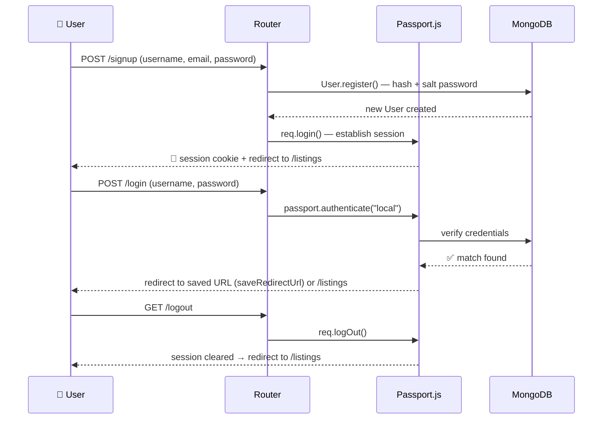
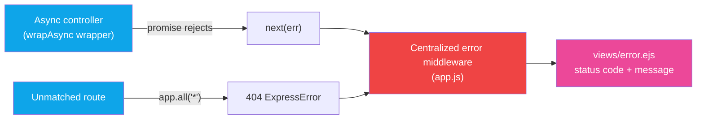

<div align="center">

# 🏡 Wanderlust — Travel Stay Booking Application

**A full-stack vacation rental booking platform inspired by Airbnb** — built with Node.js, Express, MongoDB, and EJS. Hosts can list properties with geocoded locations and cloud-hosted images; guests can search, filter by category, view listings on an interactive map, and leave star ratings and reviews.

[](https://nodejs.org/)
[](https://expressjs.com/)
[](https://www.mongodb.com/)
[](https://ejs.co/)
[](https://www.mapbox.com/)
[](https://cloudinary.com/)
[](#-license)

[](https://github.com/Swarajbabu/Wanderlust-Travel-Stay-Booking-Application/stargazers)
[](https://github.com/Swarajbabu/Wanderlust-Travel-Stay-Booking-Application/network/members)
[](https://github.com/Swarajbabu/Wanderlust-Travel-Stay-Booking-Application/commits/main)
[](https://github.com/Swarajbabu/Wanderlust-Travel-Stay-Booking-Application/issues)

</div>

---

## 📖 Overview

Wanderlust is a server-rendered (MVC) vacation rental booking application. It is a monolithic Express app — there is no separate frontend/backend split; Express renders EJS templates directly, and a small amount of vanilla client-side JS (Mapbox GL, filter-scrolling, tax toggle, Bootstrap validation) runs in the browser.

Core capabilities, all verified against the source:

- Authenticated hosts can create listings with a title, description, price, location/country, category, and an uploaded image.
- On save, the app **forward-geocodes** the listing's location string via the Mapbox Geocoding API and stores GeoJSON coordinates; the listing's `show` page renders a live Mapbox map with a marker.
- Guests can search listings (`?q=`) across title/location/country, and filter by one of 17 property categories (`?category=`).
- Logged-in users can leave a 1–5 star rating and a written comment on any listing; review authors can delete their own reviews, listing owners can delete/edit their own listings.
- Images are uploaded via Multer directly to Cloudinary (no local disk storage).
- Sessions are persisted in MongoDB via `connect-mongo`, so login state survives server restarts.

> **Note:** There is no live/hosted demo URL, admin panel, or public API documented in this repository — this is a server-rendered app run locally (see [Installation](#-installation)). If you deploy it, add your live URL here.

---

## 📑 Table of Contents

- [Overview](#-overview)
- [Screenshots](#-screenshots)
- [Features](#-features)
- [Tech Stack](#-tech-stack)
- [Folder Structure](#-folder-structure)
- [Architecture & Request Flow](#-architecture--request-flow)
- [Database Schema](#-database-schema)
- [Route / Endpoint Reference](#-route--endpoint-reference)
- [Installation](#-installation)
- [Environment Variables](#-environment-variables)
- [Seeding the Database](#-seeding-the-database)
- [Usage Guide](#-usage-guide)
- [Authentication & Authorization](#-authentication--authorization)
- [Third-Party Services](#-third-party-services)
- [Error Handling](#-error-handling)
- [Security Notes](#-security-notes)
- [Deployment](#-deployment)
- [Dependencies](#-dependencies)
- [npm Scripts](#-npm-scripts)
- [Known Limitations / Not Yet Implemented](#-known-limitations--not-yet-implemented)
- [Roadmap](#-roadmap)
- [FAQ](#-faq)
- [Troubleshooting](#-troubleshooting)
- [Contributing](#-contributing)
- [License](#-license)
- [Author](#-author)

---

## 📸 Screenshots

> Add real screenshots here — these are placeholders for the pages that exist in `views/`.

| Home / Explore | Listing Detail | Create Listing |
|---|---|---|
|  |  |  |

| Login | Signup |
|---|---|
|  |  |

---

## ✨ Features

<div align="center">

`🏘️ Listings`  `🔍 Search & Filter`  `⭐ Reviews & Ratings`  `🔐 Auth & Sessions`  `🗺️ Live Maps`  `☁️ Cloud Images`  `📱 Responsive UI`

</div>

Every feature below is confirmed directly in the codebase — routes, controllers, models, and views — nothing here is aspirational.

<table>
<tr><td width="45px" align="center">🏘️</td><td><b>Listings — full CRUD</b><br/>Create, view, edit, and delete property listings, each tagged with one of <b>17 categories</b> (Rooms, Mountains, Castles, Camping, Arctic, Houseboats, Yurts...). Only the listing <code>owner</code> can edit or delete it.</td></tr>
<tr><td align="center">📍</td><td><b>Auto-Geocoding</b><br/>Every listing's location is <b>forward-geocoded via Mapbox</b> on create/update; if an older listing is missing coordinates, they're silently backfilled the next time it's viewed.</td></tr>
<tr><td align="center">☁️</td><td><b>Cloud Image Uploads</b><br/>Listing photos are streamed straight to <b>Cloudinary</b> through Multer — no local disk storage, no broken image links.</td></tr>
<tr><td align="center">🔍</td><td><b>Search & Category Filters</b><br/>Free-text search across title, location & country, plus a scrollable category chip bar (<code>/listings?category=...</code>) for one-click discovery.</td></tr>
<tr><td align="center">⭐</td><td><b>Reviews & Star Ratings</b><br/>Logged-in users leave a 1–5 star rating + comment. Only the review's author can delete it — and deleting a listing <b>cascades</b> to remove all of its reviews automatically.</td></tr>
<tr><td align="center">🔐</td><td><b>Secure Auth & Sessions</b><br/>Passport.js local strategy with salted/hashed passwords, <b>MongoDB-persisted sessions</b>, flash-message feedback, and smart post-login redirect back to the page you started on.</td></tr>
<tr><td align="center">🗺️</td><td><b>Interactive Map</b><br/>Every listing page renders a live <b>Mapbox GL</b> map centered on its geocoded coordinates, complete with a popup marker.</td></tr>
<tr><td align="center">📱</td><td><b>Responsive, Polished UI</b><br/>Bootstrap 5 + Font Awesome + Google Fonts, shared layouts via <code>ejs-mate</code>, client-side form validation, and a dedicated error page for a clean 404/500 experience.</td></tr>
</table>

---

## 🛠️ Tech Stack

<table>
<tr>
<td valign="top" width="50%">

**⚙️ Server / Runtime**


**🖼️ View Layer**


`ejs-mate` — layouts & partials

**🗄️ Database**


`connect-mongo` — session persistence

**🔐 Authentication**


`passport-local` · `passport-local-mongoose`
`express-session` · `cookie-parser` · `connect-flash`

</td>
<td valign="top" width="50%">

**☁️ File Storage / Media**


`multer` · `multer-storage-cloudinary`

**🗺️ Maps / Geocoding**


`@mapbox/mapbox-sdk` — server-side geocoding

**✅ Validation**


Request-body schema validation for listings & reviews

**🎨 Frontend Assets**


Google Fonts (Plus Jakarta Sans, Roboto) · Starability

**🧰 Dev Tooling**


`dotenv`

</td>
</tr>
</table>

---

## 📁 Folder Structure

```
Wanderlust-Travel-Stay-Booking-Application/
├── app.js                     # App entry point: middleware, sessions, passport, routes, error handling
├── cloudconfig.js             # Cloudinary + Multer storage configuration
├── schema.js                  # Joi validation schemas (Listing, Review)
├── middleware.js              # isLoggedIn, isOwner, isReviewAuthor, validateListing, validateReview, saveRedirectUrl
│
├── controllers/
│   ├── listing.js             # index/search/filter, create, show (+geocode), edit, update, destroy
│   ├── review.js              # createReview, destroyReview
│   └── user.js                # signup, login, logout
│
├── routes/
│   ├── listing.js             # /listings CRUD routes (Multer upload + validation wired in)
│   ├── review.js              # /listings/:id/reviews (nested router, mergeParams)
│   └── user.js                # /signup, /login, /logout
│
├── modals/                    # Mongoose models (named "modals" in the actual repo)
│   ├── listing.js             # Listing schema + cascading review delete hook
│   ├── review.js              # Review schema
│   └── user.js                # User schema + passport-local-mongoose plugin
│
├── init/
│   ├── data.js                # Sample listing seed data
│   └── index.js                # Seed script — wipes and reseeds the Listing collection
│
├── utility/
│   ├── ExpressError.js        # Custom error class (statuscode + message)
│   └── wrapAsync.js           # Async route handler wrapper to forward errors to Express
│
├── views/
│   ├── layouts/boilerplate.ejs   # Shared HTML shell (CDN links, navbar, footer, flash)
│   ├── includes/                 # navbar.ejs, footer.ejs, flash.ejs partials
│   ├── listings/                 # index, show, new, edit
│   ├── users/                    # login, signup
│   └── error.ejs                 # Error page
│
├── public/
│   ├── css/                   # style.css, index.css, show.css, auth.css, listing-form.css, rating.css
│   └── js/                    # map.js (Mapbox render), script.js (client behaviors)
│
├── package.json
├── package-lock.json
└── .gitignore
```

---

## 🏗️ Architecture & Request Flow

The app follows a classic **MVC** pattern on top of Express. All diagrams below reflect the actual middleware order in `app.js`.

### 🔄 Request Lifecycle

The app follows a classic **MVC** pattern on top of Express:

```
Browser
   │
   ▼
Express App (app.js)
   │  ├─ session (connect-mongo) + passport.session()
   │  ├─ flash message middleware → res.locals.success / res.locals.error
   │  └─ res.locals.currUser ← req.user
   ▼
Router (routes/listing.js | review.js | user.js)
   │  ├─ isLoggedIn / isOwner / isReviewAuthor (authz)
   │  ├─ validateListing / validateReview (Joi)
   │  └─ multer upload (Cloudinary storage)
   ▼
Controller (controllers/*.js)
   │  ├─ Mongoose model queries (modals/*.js)
   │  ├─ Mapbox forward-geocode call (listing create/update/show-if-missing)
   │  └─ req.flash(...) + res.redirect(...) or res.render(...)
   ▼
EJS View (views/**/*.ejs via ejs-mate layout)
   │  └─ client-side JS: map.js (Mapbox GL render), script.js, filter/tax toggles
   ▼
Response → Browser
```

---


### 🔑 Authentication Flow



### ⚠️ Error Flow



> 💡 GitHub renders these Mermaid diagrams natively — no extra plugin needed to view them on the repo page.

---

## 🗄️ Database Schema

Three MongoDB collections, related via Mongoose `ObjectId` references.

### `Listing`
| Field | Type | Notes |
|---|---|---|
| `title` | String | required |
| `description` | String | |
| `image` | `{ url, filename }` | Cloudinary URL + public ID |
| `price` | Number | |
| `location` | String | free-text, used for geocoding |
| `country` | String | |
| `category` | String (enum) | one of 17 fixed categories |
| `geometry` | GeoJSON `Point` | `{ type: "Point", coordinates: [lng, lat] }`, populated via Mapbox |
| `owner` | ObjectId → `User` | |
| `reviews` | [ObjectId → `Review`] | |

### `Review`
| Field | Type | Notes |
|---|---|---|
| `comment` | String | |
| `rating` | Number | min `1`, max `5` |
| `createdAt` | Date | defaults to `Date.now()` |
| `author` | ObjectId → `User` | |

### `User`
| Field | Type | Notes |
|---|---|---|
| `email` | String | required |
| `username`, `hash`, `salt` | — | injected by the `passport-local-mongoose` plugin |

**Relationships**
- `Listing.owner` → `User` (many listings per user)
- `Listing.reviews` → `[Review]` (one-to-many, embedded as ref array)
- `Review.author` → `User` (many reviews per user)
- Deleting a `Listing` cascades to delete all of its `Review` documents (`post("findOneAndDelete")` hook in `modals/listing.js`).

> No explicit secondary indexes are defined in the schemas beyond MongoDB's default `_id` index.

---

## 🔌 Route / Endpoint Reference

All routes are server-rendered (HTML responses / redirects), not a JSON API.

### Listings — `/listings`
| Method | Route | Auth Required | Description |
|---|---|---|---|
| `GET` | `/listings` | No | List all listings; supports `?q=` (search) and `?category=` (filter) |
| `GET` | `/listings/new` | Yes | Render the new-listing form |
| `POST` | `/listings` | Yes | Create a listing (multipart form, `listing[image]` upload) |
| `GET` | `/listings/:id` | No | Show a single listing, populated with reviews + owner |
| `GET` | `/listings/:id/edit` | Yes (owner) | Render the edit form |
| `PUT` | `/listings/:id` | Yes (owner) | Update a listing (optional new image) |
| `DELETE` | `/listings/:id` | Yes (owner) | Delete a listing (cascades review deletion) |

### Reviews — `/listings/:id/reviews`
| Method | Route | Auth Required | Description |
|---|---|---|---|
| `POST` | `/` | Yes | Create a review (`review[rating]`, `review[comment]`) |
| `DELETE` | `/:reviewId` | Yes (review author) | Delete a review |

### Auth — `/`
| Method | Route | Auth Required | Description |
|---|---|---|---|
| `GET` | `/signup` | No | Render signup form |
| `POST` | `/signup` | No | Register a new user, auto-login |
| `GET` | `/login` | No | Render login form |
| `POST` | `/login` | No | Authenticate via Passport local strategy |
| `GET` | `/logout` | No | Log out current session |

### Misc
| Method | Route | Description |
|---|---|---|
| `GET` | `/` | Redirects to `/listings` |
| `*` | any unmatched route | 404 → `views/error.ejs` |

---

## 🚀 Installation

### Prerequisites
- [Node.js](https://nodejs.org/) v16+
- A MongoDB database (local instance or [MongoDB Atlas](https://www.mongodb.com/atlas))
- A [Cloudinary](https://cloudinary.com/) account (for image uploads)
- A [Mapbox](https://www.mapbox.com/) access token (for geocoding + the map widget)

### Steps

```bash
# 1. Clone the repository
git clone https://github.com/Swarajbabu/Wanderlust-Travel-Stay-Booking-Application.git
cd Wanderlust-Travel-Stay-Booking-Application

# 2. Install dependencies
npm install

# 3. Create a .env file in the project root (see Environment Variables below)

# 4. (Optional) Seed the database with sample listings
node init/index.js

# 5. Start the app
npm start
# or, for auto-reload during development:
npx nodemon app.js
```

The server listens on the port defined by `PORT` (defaults to `8080`):
```
http://localhost:8080
```

---

## 🔐 Environment Variables

These are the exact variables read via `process.env` in the codebase (`app.js`, `cloudconfig.js`, `controllers/listing.js`, `init/index.js`).

| Variable | Description | Required |
|---|---|---|
| `MONGODB_ATLAS` | MongoDB connection string (used for both the app's data and the session store) | ✅ Yes |
| `SECRET` | Session/cookie signing secret | Optional — falls back to a hardcoded default if unset (**set this in production**) |
| `PORT` | Port the Express server listens on | Optional — defaults to `8080` |
| `MAP_TOKEN` | Mapbox access token — used for forward geocoding server-side and the Mapbox GL map client-side | ✅ Yes |
| `CLOUDINARY_CLOUD_NAME` | Cloudinary cloud name | ✅ Yes |
| `CLOUDINARY_API_KEY` | Cloudinary API key | ✅ Yes |
| `CLOUDINARY_API_SECRET` | Cloudinary API secret | ✅ Yes |

Example `.env`:

```env
MONGODB_ATLAS=mongodb+srv://<user>:<password>@<cluster-url>/wanderlust
SECRET=replace_with_a_long_random_string
PORT=8080
MAP_TOKEN=pk.your_mapbox_access_token
CLOUDINARY_CLOUD_NAME=your_cloud_name
CLOUDINARY_API_KEY=your_api_key
CLOUDINARY_API_SECRET=your_api_secret
```

> `.env` is already excluded via `.gitignore` — never commit it.

---

## 🌱 Seeding the Database

`init/index.js` wipes the `Listing` collection and repopulates it from `init/data.js` (sample listings with Unsplash image URLs), assigning a hardcoded placeholder `owner` ObjectId to each. Run it with:

```bash
node init/index.js
```

> Since the seeded `owner` ID won't correspond to a real registered user, sign up a real account first if you want to test owner-only actions (edit/delete) on seeded listings.

---

## 💡 Usage Guide

1. **Sign up** at `/signup` (username, email, password) or **log in** at `/login`.
2. **Browse** listings at `/listings` — use the navbar search box to search by destination, or click a category chip (Rooms, Mountains, Castles, etc.) to filter.
3. **View a listing** to see its description, price, host, an interactive map of its location, and existing guest reviews.
4. **Leave a review** (while logged in) — pick a 1–5 star rating and write a comment.
5. **List your own property** via "Wanderlust your home" — fill in title, description, location, country, category, price, and upload an image; the location is automatically geocoded.
6. **Manage your listings** — edit or delete listings you own directly from the listing's detail page.
7. **Log out** from the profile dropdown when finished.

---

## 🔑 Authentication & Authorization

- **Strategy:** Passport.js `LocalStrategy`, backed by `passport-local-mongoose` (handles password hashing/salting and username/password verification — no plaintext passwords are ever stored).
- **Sessions:** `express-session`, persisted server-side in MongoDB via `connect-mongo` (`touchAfter: 24h`), with signed, `httpOnly` cookies (7-day expiry).
- **Flash messages:** `connect-flash` surfaces one-time success/error messages after redirects (e.g. "New Listing Created!", "You must be logged in to create listing!").
- **Route protection (`middleware.js`):**
  - `isLoggedIn` — blocks unauthenticated access to create/edit/delete actions, saving the intended URL for post-login redirect.
  - `isOwner` — restricts listing edit/update/delete to the listing's owner.
  - `isReviewAuthor` — restricts review deletion to the review's author.
- **No OAuth/social login, no JWT, no role-based (admin/user) access control** are implemented — authentication is session-cookie based only.

---

## 🌐 Third-Party Services

| Service | Purpose |
|---|---|
| **MongoDB Atlas** (or any MongoDB instance) | Primary datastore + session store |
| **Cloudinary** | Image hosting/CDN for listing photos (via Multer storage adapter) |
| **Mapbox** | Forward geocoding (`@mapbox/mapbox-sdk`) and interactive map rendering (Mapbox GL JS, loaded via CDN) |

---

## ⚠️ Error Handling

- `utility/wrapAsync.js` wraps async controller functions so rejected promises are passed to Express's `next()` instead of crashing the process.
- `utility/ExpressError.js` is a custom `Error` subclass carrying a `statuscode` and `message`.
- A catch-all route (`app.all("*")`) raises a 404 for any unmatched path.
- A single centralized error-handling middleware in `app.js` renders `views/error.ejs` with the status code and message (defaults: `500` / "Something Went Wrong").
- Controller-level validation failures (missing listing, missing review) trigger flash messages and redirects rather than hard errors, for a friendlier UX.

---

## 🔒 Security Notes

- Passwords are never stored directly — `passport-local-mongoose` handles salting/hashing.
- Session cookies are `httpOnly` with a 7-day expiry; `app.set("trust proxy", 1)` is enabled for correct cookie behavior behind a proxy (e.g. Render/Railway).
- Request bodies for listings and reviews are validated server-side with **Joi** before hitting the database.
- `.env` is git-ignored to keep credentials out of version control.

> Not currently implemented: Helmet, explicit CORS configuration, rate limiting, or input sanitization middleware beyond Joi validation. Since this is a server-rendered app (not a public JSON API), CORS is not applicable in its current form.

---

## 🚢 Deployment

No deployment configuration (Dockerfile, `docker-compose.yml`, CI/CD workflow, or Procfile) exists in this repository at present. To deploy manually:

1. Provision a MongoDB Atlas cluster and Cloudinary/Mapbox accounts.
2. Deploy the Node app to a platform such as Render, Railway, or Fly.io (any platform that runs `npm start` / `node app.js` works, since the app already respects `process.env.PORT`).
3. Set all [environment variables](#-environment-variables) in your hosting provider's dashboard.
4. Ensure outbound network access is allowed for MongoDB Atlas, Cloudinary, and the Mapbox API.

*(TODO: add your live deployment URL and platform here once deployed.)*

---

## 📦 Dependencies

| Package | Why it's used |
|---|---|
| `express` | Web framework / routing |
| `mongoose` | MongoDB object modeling |
| `ejs`, `ejs-mate` | Server-side templating with layout support |
| `passport`, `passport-local`, `passport-local-mongoose` | Authentication |
| `express-session`, `connect-mongo` | Persistent session management |
| `connect-flash` | One-time flash messages across redirects |
| `cookie-parser` | Cookie parsing |
| `method-override` | Enables PUT/DELETE from HTML forms |
| `multer`, `multer-storage-cloudinary`, `cloudinary` | Image upload → cloud storage pipeline |
| `@mapbox/mapbox-sdk` | Server-side forward geocoding |
| `joi` | Request-body schema validation |
| `dotenv` | Loads `.env` into `process.env` |
| `nodemon` | Auto-restarts the server during development |

---

## 📜 npm Scripts

| Script | Command | Description |
|---|---|---|
| `npm start` | `node app.js` | Starts the server |
| `npm test` | *(placeholder)* | No test suite is currently implemented |

> Tip: use `npx nodemon app.js` during development for auto-reload (not wired as an npm script by default).

---

## 🚧 Known Limitations / Not Yet Implemented

To keep this README honest about the current state of the code:

- No automated tests (unit/integration) — `npm test` is a placeholder.
- No Docker/CI-CD configuration.
- No admin dashboard or role-based access control.
- No booking/payment flow — the app covers listings, discovery, and reviews, not an end-to-end reservation/checkout system.
- MongoDB text search utilizes a text index on title, location, and country, falling back to case-insensitive regex search if no exact word match is found.
- No LICENSE file is present in the repo, though `package.json` declares `ISC`.

---

## 🗺️ Roadmap

- [ ] Add a booking/reservation and payment flow
- [ ] Add an admin dashboard for managing listings/users
- [ ] Add automated tests (unit + integration)
- [ ] Add Docker support and a CI/CD pipeline
- [ ] Add a LICENSE file matching the declared `ISC` license

---

## ❓ FAQ

**Q: Do I need a Mapbox account to run this locally?**
A: Yes — `MAP_TOKEN` is required both for geocoding a listing's location on create/update and for rendering the map on the listing detail page.

**Q: What happens if I don't upload an image when creating a listing?**
A: The controller falls back to a default Unsplash placeholder image URL.

**Q: Can any logged-in user edit or delete any listing?**
A: No — only the listing's `owner` can edit/delete it (`isOwner` middleware), and only a review's author can delete their own review (`isReviewAuthor` middleware).

**Q: Is there a REST/JSON API I can call from another frontend?**
A: No — routes render EJS views and issue redirects; responses are HTML, not JSON.

---

## 🛠️ Troubleshooting

| Issue | Likely Cause / Fix |
|---|---|
| App crashes on startup with a Mongo connection error | Check `MONGODB_ATLAS` is set correctly and your IP is allow-listed in Atlas |
| Images fail to upload | Verify `CLOUDINARY_CLOUD_NAME` / `CLOUDINARY_API_KEY` / `CLOUDINARY_API_SECRET` are correct |
| Map doesn't render on the listing page | `MAP_TOKEN` missing or invalid |
| New listings save with the default fallback coordinates (Hyderabad) instead of the real location | The Mapbox geocode call returned no matching features for the entered location string — try a more specific location/country |
| "You must be logged in" redirect loops | Session store (`connect-mongo`) can't reach MongoDB — check `MONGODB_ATLAS` |
| Login always fails | Confirm you're using the `username` created at signup, not the email |

---

## 🤝 Contributing

Contributions, issues, and feature suggestions are welcome.

1. Fork the repository
2. Create a feature branch: `git checkout -b feature/your-feature`
3. Commit your changes: `git commit -m "Add: your feature"`
4. Push to the branch: `git push origin feature/your-feature`
5. Open a Pull Request

---

## 📄 License

This project is declared under the **ISC License** in `package.json`. *(No `LICENSE` file is currently present in the repo — add one to make this explicit.)*

---

## 👤 Author

**Vecha Laxmi Swaraj Babu (Swaraj)**

- Portfolio: [swarajvecha.in](https://swarajvecha.in)
- GitHub: [@Swarajbabu](https://github.com/Swarajbabu)
- Project: [Wanderlust-Travel-Stay-Booking-Application](https://github.com/Swarajbabu/Wanderlust-Travel-Stay-Booking-Application)

---

## 🙏 Acknowledgements

- [Bootstrap](https://getbootstrap.com/), [Font Awesome](https://fontawesome.com/), and [Google Fonts](https://fonts.google.com/) for UI
- [Mapbox](https://www.mapbox.com/) for geocoding and map rendering
- [Cloudinary](https://cloudinary.com/) for image hosting
- [Starability](https://github.com/LunarLogic/starability) for the CSS star-rating widget
- Sample listing imagery sourced from [Unsplash](https://unsplash.com/)

---

<div align="center">

### ⭐ If this project helped you, consider giving it a star on GitHub!

</div>
